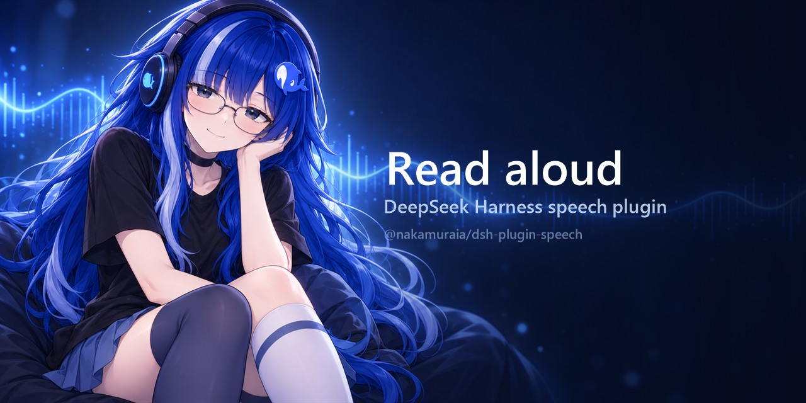

# dsh-plugin-speech

[English](README.md) | 中文



在 [DeepSeek Harness](https://github.com/deepseek-ai/deepseek-harness) 中朗读助手回复：音频在生成过程中即开始播放。

## 它做什么

每条已完成的助手消息在其操作行中多出一个播放控件。按下即朗读该回复，再按一次停止。「通用」设置中新增一行，用于选择服务、声音与调音。

回复以**一个请求**发出，音频**边到达边播放**，因此第一帧到达时就开始发声，而不必等整个文件。相当于把「看回答逐字出现」的体验搬到音频上。

## 服务提供方

| 服务 | 需要密钥 | 声音 |
|---|---|---|
| **Microsoft Edge**（默认） | 否 | 该服务公开完整目录，覆盖其支持的所有语言 |

新增一个提供方，只需在 `src/providers/` 下加一个目录，并在 `src/providers/registry.ts` 中加一行——设置界面会根据该提供方声明的字段自动生成。

## 环境要求

- DeepSeek Harness 的 Web 界面（`dsh web`），版本 `0.1.5-rc.2` 或更新。
- 能访问语音服务的网络。除此之外没有别的：无需下载模型，Edge 提供方也不需要账号。

## 安装

1. 把包加入你的 harness 检出目录：

   ```sh
   pnpm add -w @nakamuraia/dsh-plugin-speech
   ```

   若想直接跟随源码，也可以从 GitHub 安装：

   ```sh
   pnpm add -w github:NakamuraIA/dsh-plugin-speech
   ```

2. 把 `speech.patch.yml` 复制到检出目录旁，并用它启动 Web 界面：

   ```sh
   dsh web --patch ./speech.patch.yml
   ```

该 patch 只添加一行 Loader 条目。条目名既是包名，也是构建产物注册所用的浏览器模块 id，两者必须保持一致——不要只改其中一个。

## 设置

设置打开后位于**通用**分区，其中**朗读**一行负责：

- **服务**：由哪个提供方合成。
- **语言**与**声音**：要使用目录中的哪一个。
- **速度**、**音量**、**音高**：随每次请求发送给服务。
- **跳过代码**：朗读时不读围栏代码与行内代码。
- **试听**：按屏幕上的设置（保存与否都算）朗读一段示例。

代码块、表格以及粘贴的电子表格一律不读；链接保留文字、丢弃地址；emoji、引号与孤立符号会被去掉。句末标点保留，因为语音用它来断句。

## 工作原理

```
浏览器                      主机                        服务
──────                      ────                        ────
点击 ─ ▶ POST /speech/speak { text }
                            从持久化设置里
                            选出提供方
                            ────────────────────────── ▶ 合成
        ◀ ─ 音频字节持续回流 ─ ─ ─ ─ ─ ─ ─ ─ ─ ─ ─ ─ ─ ┘
到达即播放
```

合成放在主机侧，因为浏览器既不能持有 API 密钥，也无法跨 CORS 访问大多数服务。浏览器只负责发文本、放字节。

## 开发

源码在 DeepSeek Harness 检出目录内开发，因为类型包与客户端构建预设都在那里；本仓库保存源码与构建产物。要重新构建，把 `src/` 复制回检出目录的 `packages/client/ui-speech/`，在那里改名后运行其构建。

## 许可

MIT。Edge 提供方通过 [`msedge-tts`](https://github.com/harvey-woo/msedge-tts)（MIT）调用微软的朗读端点；该端点并非微软公开支持的 API，因此其可用性按尽力而为对待。
